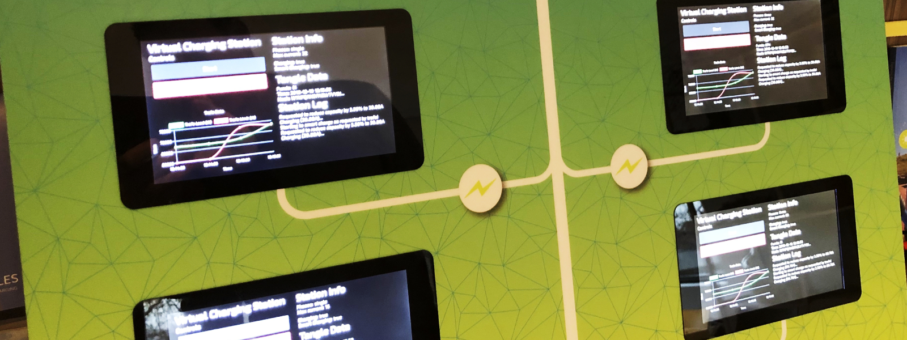

# Self Balancing Grid
How devices can balance the grid themselves

## Background
In 2017 when we started to develop the [Electric Vehicle charger that was solely using IOTA](https://medium.com/@harmvandenbrink/how-elaadnl-built-a-poc-charge-station-running-fully-on-iota-and-iota-only-e16ed4c4d4d5) as a payment solution and communication solution, and in beginning 2018 when we created the [world’s first IOTA Smart Charging station](https://blog.iota.org/worlds-first-iota-smart-charging-station-52f9024db788) we already had in mind that this charger was only one part of the vision we had in mind.

A charge station is the first device in our grid that consumes a lot of energy, is connected, and is probably used on a massive scale in the future. For the last decade we tried to use less energy in our homes, but we have to admit that we’ve be using more and more electric energy. Heat pumps, electric cars and other electricity powered devices will only add more to that.

This means that we’ll start using the grid more, and probably reach the limits of our grids. Back in the days when the cables were put in the ground, we weren’t thinking about heat pumps, electric cars and other high power devices that we are going to use today. The challenge is not that we can’t deliver the energy required, but the challenge is that we use that energy all at the same time of the day; usually in the morning around 8 and in the evening around 7. Our grid is not capable of handling that peak demand, and it’s pretty useless to invest lots of money to deal with the peak for let’s say 30 to 60 minutes a day, while we have the technology to spread the energy usage over time.

We built a demonstrator to show a solution where devices adjust their power usage based on messages from a transformer.

## Technicals
[Read our blogpost](https://medium.com/@harmvandenbrink/self-balancing-grid-with-smart-transformers-and-smart-devices-721bb962c3ac) to find out how it works and why we chose to do stuff a certain way. Below you will find the steps to run the code!

### Raspberry Pi
Run the [install_deps_pi.sh](./install_deps_pi.sh) script to install all dependencies. After that, copy the contents of the [src-trafo](./src-trafo) or [src-cp](./src-cp) to the `~/electron` folder on the Raspberry Pi. 

Make sure to create a config file based on our template! 

### Backend
Copy the [src-api](./src-api) folder to a vps and run `npm install` to install all dependencies. Then simply run `node server.js` to get started!
